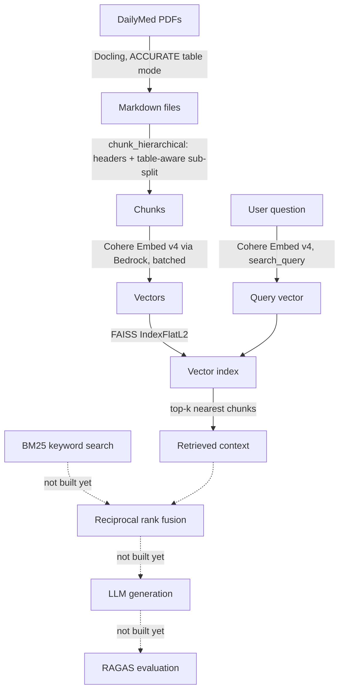

# Architecture

Current pipeline — extraction and chunking and dense retrieval are built; hybrid retrieval, generation, and evaluation are not yet.

## Why these choices

- **Docling, ACCURATE mode** — tested FAST vs ACCURATE on a sample file; ACCURATE didn't fix every table issue but is the safer default for clinically load-bearing content (see `Notes.md` Day 1).
- **Hierarchical + table-aware chunking** — plain fixed-size chunking was found to cut markdown tables in half mid-row, producing chunks with numbers and no column context. Table-aware splitting keeps a detected table (any line starting with `|`) as one atomic chunk, generically, not hardcoded to one document (see `Notes.md` Day 2).
- **Cohere Embed v4 (Bedrock)** — compared against Amazon Titan v1/v2 (also on Bedrock); picked the newer, stronger option after verifying real invoke access, not just listing availability. Anthropic has no embedding models; OpenAI/Qwen aren't on Bedrock and would need a separate setup (see `Notes.md` Day 3).
- **FAISS `IndexFlatL2`** — brute-force nearest-neighbor search, no approximation. The deliberately naive baseline this project's benchmark table compares hybrid retrieval against later.
- **Batched embedding calls** — embedding one chunk per API call hit Bedrock's rate limit at 600 chunks. Batches of 90 texts per call fixed it (see `Notes.md` Day 3).

## Known gap in what's built

Dense-only retrieval is pure semantic similarity — no keyword matching. Exact drug names, dose numbers, or product codes can sometimes match better on literal text than on vector similarity. Hybrid retrieval (BM25 + dense, via reciprocal rank fusion) is meant to cover that gap and is the next piece to build.
